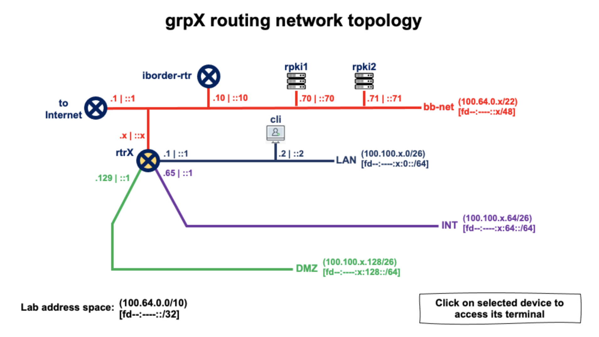

# Automatización (Utilizando Ansible y BGPq4)

------

***Creado por:***

***Santiago Aggio***,
***Nicolas Antoniello*** (*GitHub: 65007*),
***Guillermo Cicileo,***
***Erika Vega***

> (2022-10-03)

------


## Arquitectura de red del laboratorio




> This Lab assumes you have access to the Lab platform

```
     EQUIPO          DIRECCION IPv4            DIRECCION IPv6

+--------------+-----------------------+-----------------------------+
| grpX-cli     | 100.100.X.2 (eth0)    | fddf:b98d:X::2 (eth0)        |
+--------------+-----------------------+-----------------------------+
| grpX-rtr     | 100.64.1.X (eth0)     | fddf:b98d:X::1 (eth1)        |
|              | 100.100.X.65 (eth2)   | fddf:b98d:X:64::1 (eth2)     |
|              | 100.100.X.193 (eth4)  | fddf:b98d:X:192::1 (eth4)    |
|              | 100.100.X.129 (eth3)  | fddf:b98d:X:128::1 (eth3)    |
|              | 100.100.X.1 (eth1)    | fddf:b98d:0:1::X (eth0)      |
+--------------+-----------------------+-----------------------------+
| iborder-rtr  | 198.18.0.2 (wg0)      | fddf:b98d::10 (eth0)         |
+--------------+-----------------------+-----------------------------+
| rpki1        | 100.64.0.70 (eth0)    | fddf:b98d::70 (eth0)         |
+--------------------------------------+-----------------------------+
| rpki2        | 100.64.0.71 (eth0)    | fddf:b98d::71 (eth0)         |
+--------------+-----------------------+-----------------------------+
```

Donde en esta práctica **solamente** vamos a acceder a los siguientes equipos:

* **grpX-cli** : cliente
* **grpX-rtr** : router (de borde) correspondiente a las redes del equipo X


Los siguientes equipos también serán utilizados durante la práctica, sin embargo los grupos no tendrán acceso a los mismos, siendo estos configurados por los tutores encargados del laboratorio:

* **iborder-rtr** : router de borde para todo el laboratorio


## Verificando la configuración del validador RPKI FORT (*rpki1* y *rpki2*)

Uno de los tutores del Laboratorio mostrará la configuración del validador FORT (contenido del archivo ***/etc/fort/config.json*** en el servidor **rpki1** o **rpki2**):

```
root@rpki1:~# more /etc/fort/config.json 

{
	"tal": "/var/fort/tal",
	"local-repository": "/var/fort/repository",
	"rsync-strategy": "root",
	"shuffle-uris": true,
	"mode": "server",

	"server": {
		"port": "323",
		"backlog": 100,
		"interval": {
	            "validation": 900,
	            "refresh": 900,
	            "retry": 600,
	            "expire": 7200
	        }
	},

	"log": {
		"color-output": true,
		"file-name-format": "file-name"
	},

	"rsync": {
		"program": "rsync",
		"arguments-recursive": [
			"--recursive",
			"--times",
			"$REMOTE",
			"$LOCAL"
		],
		"arguments-flat": [
			"--times",
			"--dirs",
			"$REMOTE",
			"$LOCAL"
		]
	},

	"incidences": [
		{
			"name": "incid-hashalg-has-params",
			"action": "ignore"
		}
	],

	"output": {
		"roa": "/var/fort/fort_roas.csv"
	}
}

```


#### Agregamos entonces algunos route-map y listas de acceso que utilizaremos más tarde

> Los siguientes los iremos explicando a medida que los utilicemos durante la práctica
>

```
ip prefix-list DENY-ALL-IPv4 seq 5 deny any
ip prefix-list PERMIT-ALL-IPv4 seq 5 permit any
!
ipv6 prefix-list DENY-ALL-IPv6 seq 5 deny any
ipv6 prefix-list PERMIT-ALL-IPv6 seq 5 permit any
!
route-map PERMIT-SOME-ASN permit 10
 match as-path AS-PATH-PERMIT-LIST
!
route-map TODO-IPv6 permit 10
 match ipv6 address prefix-list PERMIT-ALL-IPv6
!
route-map NADA-IPv6 permit 10
 match ipv6 address prefix-list DENY-ALL-IPv6
!
route-map TODO-IPv4 permit 10
 match ip address prefix-list PERMIT-ALL-IPv4
!
route-map NADA-IPv4 permit 10
 match ipv6 address prefix-list DENY-ALL-IPv4
!
route-map RPKI permit 10
 match rpki valid
 set local-preference 200
!
route-map RPKI permit 20
 match rpki notfound
 set local-preference 100
```


