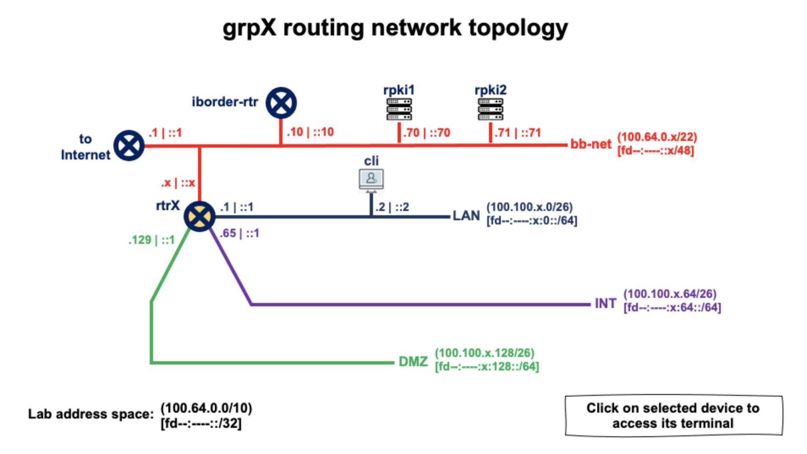

# RPKI Lab (Using a FORT validator and FRR software router)

------

***Created by:***

***Santiago Aggio***,
***Nicolas Antoniello*** (*GitHub: 65007*),
***Guillermo Cicileo,***
***Erika Vega,***
***Silvia Chavez***

> Updated: (2025-03-08)

------


## Laboratory network architecture




> This Lab assumes you have access to the Lab platform

```
      HOST           IPv4 ADDRESS               IPv6 ADDRESS

+--------------+-----------------------+-----------------------------+
| grpX-cli     | 100.100.X.2 (eth0)    | fd3a:d409:X::2 (eth0)        |
+--------------+-----------------------+-----------------------------+
| grpX-rtr     | 100.64.1.X (eth0)     | fd3a:d409:X::1 (eth1)        |
|              | 100.100.X.65 (eth2)   | fd3a:d409:X:64::1 (eth2)     |
|              | 100.100.X.193 (eth4)  | fd3a:d409:X:192::1 (eth4)    |
|              | 100.100.X.129 (eth3)  | fd3a:d409:X:128::1 (eth3)    |
|              | 100.100.X.1 (eth1)    | fd3a:d409:0:1::X (eth0)      |
+--------------+-----------------------+-----------------------------+
| iborder-rtr  | 198.18.0.2 (wg0)      | fd3a:d409::10 (eth0)         |
+--------------+-----------------------+-----------------------------+
| rpki1        | 100.64.0.70 (eth0)    | fd3a:d409::70 (eth0)         |
+--------------------------------------+-----------------------------+
| rpki2        | 100.64.0.71 (eth0)    | fd3a:d409::71 (eth0)         |
+--------------+-----------------------+-----------------------------+
```

In this practice **we will only** access the following equipment:

* **grpX-cli** : client
* **grpX-rtr** : router (border router) connecting X group networks


The following equipment will also be used during the practice, however the groups will not have access to them, these being configured by the tutors in charge of the laboratory:

* **rpki1** : RPKI validator (FORT)
* **rpki2** : RPKI validator (FORT)
* **iborder-rtr** : router implementing the IXP route server


## Verifying FORT RPKI validator configuration (*rpki1* and *rpki2*)

One of the Lab tutors will show the FORT validator configuration (contents of the ***/etc/fort/config.json*** file on the **rpki1** or **rpki2** server):

```
root@rpki1:~# more /etc/fort/config.json 

{
	"tal": "/var/fort/tal",
	"local-repository": "/var/fort/repository",
	"rsync-strategy": "root",
	"shuffle-uris": true,
	"mode": "server",

	"server": {
		"port": "323",
		"backlog": 100,
		"interval": {
	            "validation": 900,
	            "refresh": 900,
	            "retry": 600,
	            "expire": 7200
	        }
	},

	"log": {
		"color-output": true,
		"file-name-format": "file-name"
	},

	"rsync": {
		"program": "rsync",
		"arguments-recursive": [
			"--recursive",
			"--times",
			"$REMOTE",
			"$LOCAL"
		],
		"arguments-flat": [
			"--times",
			"--dirs",
			"$REMOTE",
			"$LOCAL"
		]
	},

	"incidences": [
		{
			"name": "incid-hashalg-has-params",
			"action": "ignore"
		}
	],

	"output": {
		"roa": "/var/fort/fort_roas.csv"
	}
}

```


The files corresponding to the TALs of each of the 5 RIRs are located in the ***/var/fort/tal/*** directory:

```
root@rpki1:~# ls -larth /var/fort/tal/

total 6.0K
drwxr-xr-x 4 root root   5 Sep 24 00:36 ..
-rw-r--r-- 1 root root 496 Sep 20 15:10 afrinic.tal
-rw-r--r-- 1 root root 466 Sep 20 15:10 apnic.tal
-rw-r--r-- 1 root root 487 Sep 20 15:10 arin.tal
-rw-r--r-- 1 root root 502 Sep 20 15:10 lacnic.tal
-rw-r--r-- 1 root root 482 Sep 20 15:10 ripe-ncc.tal
drwxr-xr-x 2 root root   7 Sep 20 15:10 .
```


Now we will update the files with the TALs by downloading them again from the 5 RIRs, using the following command:

```
root@rpki1:~# fort --init-tals --tal /var/fort/tal
```

```
Sep 27 18:11:44 DBG: HTTP GET: https://rpki.afrinic.net/tal/afrinic.tal
Successfully fetched '/var/fort/tal/afrinic.tal'!

Sep 27 18:11:45 DBG: HTTP GET: https://tal.apnic.net/apnic.tal
Successfully fetched '/var/fort/tal/apnic.tal'!

Attention: ARIN requires you to agree to their Relying Party Agreement (RPA) before you can download and use their TAL.
Please download and read https://www.arin.net/resources/manage/rpki/rpa.pdf
If you agree to the terms, type 'yes' and hit Enter: Sep 27 18:11:47 DBG: HTTP GET: https://www.arin.net/resources/manage/rpki/arin.tal
Successfully fetched '/var/fort/tal/arin.tal'!

Sep 27 18:11:47 DBG: HTTP GET: https://www.lacnic.net/innovaportal/file/4983/1/lacnic.tal
Successfully fetched '/var/fort/tal/lacnic.tal'!

Sep 27 18:11:48 DBG: HTTP GET: https://tal.rpki.ripe.net/ripe-ncc.tal
Successfully fetched '/var/fort/tal/ripe-ncc.tal'!
```


We confirm (looking at the date) that we do indeed have the current version of the TAL (in the ***/var/fort/tal/*** directory):

```
root@rpki1:~# ls -larth /var/fort/tal/

total 6.0K
drwxr-xr-x 4 root root   5 Sep 24 00:36 ..
-rw-r--r-- 1 root root 496 Sep 27 18:11 afrinic.tal
-rw-r--r-- 1 root root 466 Sep 27 18:11 apnic.tal
-rw-r--r-- 1 root root 487 Sep 27 18:11 arin.tal
-rw-r--r-- 1 root root 502 Sep 27 18:11 lacnic.tal
-rw-r--r-- 1 root root 482 Sep 27 18:11 ripe-ncc.tal
drwxr-xr-x 2 root root   7 Sep 27 18:11 .
```


And we restart the FORT validator process (remember that the validator was installed and run as a system daemon):

```
root@rpki1:~# systemctl restart fortd
```

```
root@rpki1:~# systemctl status fortd

● fortd.service - FORT service (fort) - FORT RPKI validator
     Loaded: loaded (/lib/systemd/system/fortd.service; enabled; vendor preset: enabled)
    Drop-In: /run/systemd/system/service.d
             └─zzz-lxc-service.conf
     Active: active (running) since Mon 2021-09-27 18:15:10 UTC; 7s ago
   Main PID: 1956 (fort)
      Tasks: 37 (limit: 19204)
     Memory: 13.2M
     CGroup: /system.slice/fortd.service
             └─1956 /usr/local/bin/fort --configuration-file=/etc/fort/config.json

Sep 27 18:15:10 rpki1.lac.te-labs.training systemd[1]: Started FORT service (fort) - FORT RPKI validator.
Sep 27 18:15:10 rpki1.lac.te-labs.training fort[1956]: INF: Disabling validation logging on syslog.
Sep 27 18:15:10 rpki1.lac.te-labs.training fort[1956]: INF: Disabling validation logging on standard streams.
Sep 27 18:15:10 rpki1.lac.te-labs.training fort[1956]: INF: Console log output configured; disabling operation logging on syslog.
Sep 27 18:15:10 rpki1.lac.te-labs.training fort[1956]: INF: (Operation Logs will be sent to the standard streams only.)
```


Looking at the **fortd** daemon log (***/var/log/fortd.log***) we see that it started the first validation cycle (after the restart), so we will have to wait for this first cycle to finish before we can use the validator:

```
root@rpki1:~# tail -f /var/log/fortd.log

/usr/local/bin/fort(+0x3577a)[0x55c4aa92077a]
/usr/local/bin/fort(+0x362a1)[0x55c4aa9212a1]
/usr/local/bin/fort(+0x45fbc)[0x55c4aa930fbc]
/lib/x86_64-linux-gnu/libpthread.so.0(+0x9609)[0x7fc904e47609]
/lib/x86_64-linux-gnu/libc.so.6(clone+0x43)[0x7fc904d6e293]
Sep 27 18:15:10 INF: Disabling validation logging on syslog.
Sep 27 18:15:10 INF: Disabling validation logging on standard streams.
Sep 27 18:15:10 INF: Console log output configured; disabling operation logging on syslog.
Sep 27 18:15:10 INF: (Operation Logs will be sent to the standard streams only.)
Sep 27 18:15:10 WRN: First validation cycle has begun, wait until the next notification to connect your router(s)
```


Once the cycle finishes, the following message will appear in the log (***/var/log/fortd.log***):

```
Sep 27 18:18:13 WRN: First validation cycle successfully ended, now you can connect your router(s)
```

> Note that it may take several minutes for the validator to complete the first validation cycle.


### Viewing ROAs via an RTR client (this must be executed in ***cli*** device)

To simulate the behavior of our router and verify the RTR (RPKI To Router) protocol against the validator, we run the rtrclient command pointing to the validator's IP address (***100.64.0.70*** or ***100.64.0.71***) and to the ***TCP 323*** port where the validator responds. The rest of the parameters are to indicate the output format (csv) and the file where to store the information.

We'll first have to install/update a library in order to be able to use ***`rtrclient`***

```
# sudo apt install librtr0
```

Then we can go ahead and execute ***rtrclient***

```
rtrclient -e -t csv -o roas.csv tcp 100.64.0.70 323
```

We can check if our IPv4, IPv6 blocks and the respective ASN are in the list of valid ROAs

```
grep "IPv4_prefix" roas.csv
```

 or

```
grep "IPv6_prefix" roas.csv
```

 or

```
grep ", ASN$" roas.csv
```


## Verifying the configuration of the ***iborder-rtr*** border router

One of the Lab tutors will show the border router configuration (contents of the file ***/etc/frr/frr.conf*** on the **iborder-rtr**):

```
root@iborder-rtr:~# more /etc/frr/frr.conf

frr version 8.0.1
frr defaults traditional
hostname iborder-rtr
service integrated-vtysh-config
!
ip route 0.0.0.0/0 100.64.0.1
ip route 198.18.0.2/32 172.30.0.1
ipv6 route ::/0 fd3a:d409::1
!
interface eth0
 description "class backbone"
 ip address 100.64.0.10/22
 ipv6 address fd3a:d409::10/48
!
interface wg0
 description "ISP LACNOG"
 ip address 172.30.0.2/29
!
router bgp 65000
 bgp router-id 100.64.0.10
 bgp log-neighbor-changes
 no bgp default ipv4-unicast
 neighbor 100.64.1.1 remote-as 65001
 neighbor 100.64.1.1 description grp1-rtr
 neighbor 100.64.1.2 remote-as 65002
 neighbor 100.64.1.2 description grp2-rtr
 neighbor 100.64.1.3 remote-as 65003
 neighbor 100.64.1.3 description grp3-rtr
 ...
 neighbor 172.30.0.1 remote-as 64135
 neighbor 172.30.0.1 description iborder-rtr-LACNOG
 neighbor fd3a:d409:0:1::1 remote-as 65001
 neighbor fd3a:d409:0:1::1 description grp1-rtr
 neighbor fd3a:d409:0:1::2 remote-as 65002
 neighbor fd3a:d409:0:1::2 description grp2-rtr
 neighbor fd3a:d409:0:1::3 remote-as 65003
 neighbor fd3a:d409:0:1::3 description grp3-rtr
 ...
 !
 address-family ipv4 unicast
  neighbor 100.64.1.1 activate
  neighbor 100.64.1.1 soft-reconfiguration inbound
  neighbor 100.64.1.1 route-map TODO-IPv4 in
  neighbor 100.64.1.1 route-map TODO-IPv4 out
  neighbor 100.64.1.2 activate
  neighbor 100.64.1.2 soft-reconfiguration inbound
  neighbor 100.64.1.2 route-map TODO-IPv4 in
  neighbor 100.64.1.2 route-map TODO-IPv4 out
  neighbor 100.64.1.3 activate
  neighbor 100.64.1.3 soft-reconfiguration inbound
  neighbor 100.64.1.3 route-map TODO-IPv4 in
  neighbor 100.64.1.3 route-map TODO-IPv4 out
  ...
  neighbor 172.30.0.1 activate
  neighbor 172.30.0.1 soft-reconfiguration inbound
  neighbor 172.30.0.1 route-map PERMIT-SOME-ASN in
  neighbor 172.30.0.1 route-map NADA-IPv4 out
 exit-address-family
 !
 address-family ipv6 unicast
  neighbor 172.30.0.1 activate
  neighbor 172.30.0.1 soft-reconfiguration inbound
  neighbor 172.30.0.1 route-map PERMIT-SOME-ASN in
  neighbor 172.30.0.1 route-map NADA-IPv4 out
  neighbor fd3a:d409:0:1::1 activate
  neighbor fd3a:d409:0:1::1 soft-reconfiguration inbound
  neighbor fd3a:d409:0:1::1 route-map TODO-IPv6 in
  neighbor fd3a:d409:0:1::1 route-map TODO-IPv6 out
  neighbor fd3a:d409:0:1::2 activate
  neighbor fd3a:d409:0:1::2 soft-reconfiguration inbound
  neighbor fd3a:d409:0:1::2 route-map TODO-IPv6 in
  neighbor fd3a:d409:0:1::2 route-map TODO-IPv6 out
  neighbor fd3a:d409:0:1::3 activate
  neighbor fd3a:d409:0:1::3 soft-reconfiguration inbound
  neighbor fd3a:d409:0:1::3 route-map TODO-IPv6 in
  neighbor fd3a:d409:0:1::3 route-map TODO-IPv6 out
  ...
 exit-address-family
!
ip prefix-list DENY-ALL-IPv4 seq 5 deny any
ip prefix-list PERMIT-ALL-IPv4 seq 5 permit any
!
ipv6 prefix-list DENY-ALL-IPv6 seq 5 deny any
ipv6 prefix-list PERMIT-ALL-IPv6 seq 5 permit any
!
bgp as-path access-list AS-PATH-PERMIT-LIST seq 10 permit _28000_
bgp as-path access-list AS-PATH-PERMIT-LIST seq 20 permit _28001_
bgp as-path access-list AS-PATH-PERMIT-LIST seq 30 permit _12654_
bgp as-path access-list AS-PATH-PERMIT-LIST seq 40 permit _196615_
bgp as-path access-list AS-PATH-PERMIT-LIST seq 50 permit _64135_
bgp as-path access-list AS-PATH-PERMIT-LIST seq 60 permit _64136_
!
route-map NADA-IPv4 permit 10
 match ip address prefix-list DENY-ALL-IPv4
!
route-map PERMIT-SOME-ASN permit 10
 match as-path AS-PATH-PERMIT-LIST
!
route-map NADA-IPv6 permit 10
 match ipv6 address prefix-list DENY-ALL-IPv6
!
route-map TODO-IPv4 permit 10
 match ip address prefix-list PERMIT-ALL-IPv4
!
route-map TODO-IPv6 permit 10
 match ipv6 address prefix-list PERMIT-ALL-IPv6
!
route-map RPKI permit 10
 match rpki valid
 set local-preference 200
!
route-map RPKI permit 20
 match rpki notfound
 set local-preference 100
!
line vty
!
end
```


We see that this edge router has an established BGP session with an ISP from which it receives the global IPv4 and IPv6 table.

BGP sessions with each of the edge routers in the groups are also pre-configured on this edge router, waiting for them to configure the BGP sessions on their side.

To avoid overloading all the routers in the groups and the lab in general, a filter was applied that will only allow BGP to put some prefixes (corresponding to certain ASNs) in the BGP tables (both IPv4 and IPv6).


> ***Finally, note that this router does not have any route filter based on RPKI information; it forwards to the group's border routers (clients) all the prefixes allowed in the BGP filter by ASN mentioned above*** ***(at the same time, accepting everything that the clients send)***.


## Verifying the initial configuration of the edge routers of the X groups

We verify the initial configuration of the border router corresponding to our equipment (**grpX-rtr**):

```
grpX-rtr# sh run
Building configuration...

Current configuration:
!
frr version 8.0.1
frr defaults traditional
hostname grpX-rtr
service integrated-vtysh-config
!
ip route 0.0.0.0/0 100.64.0.1
ipv6 route ::/0 fd3a:d409::1
!
interface eth0
 description "class backbone"
 ip address 100.64.1.X/22
 ipv6 address fd3a:d409:0:1::X/48
!
interface eth1
 description "lan"
 ip address 100.100.X.1/26
 ipv6 address fd3a:d409:X::1/64
!
interface eth2
 description "int"
 ip address 100.100.X.65/26
 ipv6 address fd3a:d409:X:64::1/64
!
interface eth3
 description "dmz"
 ip address 100.100.X.129/26
 ipv6 address fd3a:d409:X:128::1/64
!
interface eth4
 description "extra"
 ip address 100.100.X.193/26
 ipv6 address fd3a:d409:X:192::1/64
!
line vty
!
end
```

> At this point it is advisable to review the network diagram corresponding to each group again and identify the interfaces already configured on the equipment router.


Now, we will modify the router configuration corresponding to our equipment, so that it is as follows (*the details of the configuration steps are below*):

```
grpX-rtr# sh run
Building configuration...

Current configuration:
!
frr version 8.0.1
frr defaults traditional
hostname grpX-rtr
rpki
 rpki polling_period 300
 rpki cache 100.64.0.70 323 preference 1
 rpki cache 100.64.0.71 323 preference 2
 exit
service integrated-vtysh-config
!
ip route 0.0.0.0/0 100.64.0.1
ipv6 route ::/0 fd3a:d409::1
!
interface eth0
 description "class backbone"
 ip address 100.64.1.X/22
 ipv6 address fd3a:d409:0:1::X/48
!
interface eth1
 description "lan"
 ip address 100.100.X.1/26
 ipv6 address fd3a:d409:X::1/64
!
interface eth2
 description "int"
 ip address 100.100.X.65/26
 ipv6 address fd3a:d409:X:64::1/64
!
interface eth3
 description "dmz"
 ip address 100.100.X.129/26
 ipv6 address fd3a:d409:X:128::1/64
!
interface eth4
 description "extra"
 ip address 100.100.X.193/26
 ipv6 address fd3a:d409:X:192::1/64
!
router bgp 6500X
 bgp router-id 100.64.1.X
 bgp log-neighbor-changes
 no bgp default ipv4-unicast
 neighbor 100.64.0.10 remote-as 65000
 neighbor 100.64.0.10 description iborder-rtr
 neighbor fd3a:d409::10 remote-as 65000
 neighbor fd3a:d409::10 description iborder-rtr
 !
 address-family ipv4 unicast
  neighbor 100.64.0.10 activate
  neighbor 100.64.0.10 soft-reconfiguration inbound
  neighbor 100.64.0.10 route-map TODO-IPv4 in
  neighbor 100.64.0.10 route-map TODO-IPv4 out
 exit-address-family
 !
 address-family ipv6 unicast
  neighbor fd3a:d409::10 activate
  neighbor fd3a:d409::10 soft-reconfiguration inbound
  neighbor fd3a:d409::10 route-map TODO-IPv6 in
  neighbor fd3a:d409::10 route-map TODO-IPv6 out
 exit-address-family
!
ip prefix-list DENY-ALL-IPv4 seq 5 deny any
ip prefix-list PERMIT-ALL-IPv4 seq 5 permit any
!
ipv6 prefix-list DENY-ALL-IPv6 seq 5 deny any
ipv6 prefix-list PERMIT-ALL-IPv6 seq 5 permit any
!
route-map PERMIT-SOME-ASN permit 10
 match as-path AS-PATH-PERMIT-LIST
!
route-map TODO-IPv6 permit 10
 match ipv6 address prefix-list PERMIT-ALL-IPv6
!
route-map NADA-IPv6 permit 10
 match ipv6 address prefix-list DENY-ALL-IPv6
!
route-map TODO-IPv4 permit 10
 match ip address prefix-list PERMIT-ALL-IPv4
!
route-map NADA-IPv4 permit 10
 match ipv6 address prefix-list DENY-ALL-IPv4
!
route-map RPKI permit 10
 match rpki valid
 set local-preference 200
!
route-map RPKI permit 20
 match rpki notfound
 set local-preference 100
!
line vty
!
end
```


#### We then add some route-maps and access-lists that we will use later.

> We will explain the following as we use them during practice.
>

```
ip prefix-list DENY-ALL-IPv4 seq 5 deny any
ip prefix-list PERMIT-ALL-IPv4 seq 5 permit any
!
ipv6 prefix-list DENY-ALL-IPv6 seq 5 deny any
ipv6 prefix-list PERMIT-ALL-IPv6 seq 5 permit any
!
route-map PERMIT-SOME-ASN permit 10
 match as-path AS-PATH-PERMIT-LIST
!
route-map TODO-IPv6 permit 10
 match ipv6 address prefix-list PERMIT-ALL-IPv6
!
route-map NADA-IPv6 permit 10
 match ipv6 address prefix-list DENY-ALL-IPv6
!
route-map TODO-IPv4 permit 10
 match ip address prefix-list PERMIT-ALL-IPv4
!
route-map NADA-IPv4 permit 10
 match ipv6 address prefix-list DENY-ALL-IPv4
!
route-map RPKI permit 10
 match rpki valid
 set local-preference 200
!
route-map RPKI permit 20
 match rpki notfound
 set local-preference 100
```


#### We configure the BGP session with the border router (**iborder-rtr**)

> Note that our autonomous system will be 650XX, changing the XX to our group number (1 for group 1, ... 12 for group 12, etc.). So group 1 will have ASN 65001 and group 12 will have ASN 65012.
>

We configured 2 BGP sessions, one IPv4 and one IPv6.

At this point, we will apply policies (***route-map***) in both sessions in order to ***allow all*** the prefixes received from the border router and advertise to it all the ones we have in our BGP table (for this we use some of the route-maps created previously): ***route-map TODO-IPv4*** and ***route-map TODO-IPv6***.

```
router bgp 650XX
 bgp router-id 100.64.1.X
 bgp log-neighbor-changes
 no bgp default ipv4-unicast
 neighbor 100.64.0.10 remote-as 65000
 neighbor 100.64.0.10 description iborder-rtr
 neighbor fd3a:d409::10 remote-as 65000
 neighbor fd3a:d409::10 description iborder-rtr
 !
 address-family ipv4 unicast
  neighbor 100.64.0.10 activate
  neighbor 100.64.0.10 soft-reconfiguration inbound
  neighbor 100.64.0.10 route-map TODO-IPv4 in
  neighbor 100.64.0.10 route-map TODO-IPv4 out
 exit-address-family
 !
 address-family ipv6 unicast
  neighbor fd3a:d409::10 activate
  neighbor fd3a:d409::10 soft-reconfiguration inbound
  neighbor fd3a:d409::10 route-map TODO-IPv6 in
  neighbor fd3a:d409::10 route-map TODO-IPv6 out
 exit-address-family
```


#### We visualize the status of BGP sessions (IPv6)

```
grpX-rtr# sh bgp ipv6 unicast summary 
BGP router identifier 100.64.1.X, local AS number 650XX vrf-id 0
BGP table version 557
RIB entries 88, using 16 KiB of memory
Peers 1, using 723 KiB of memory

Neighbor        V         AS   MsgRcvd   MsgSent   TblVer  InQ OutQ  Up/Down State/PfxRcd   PfxSnt Desc
fd3a:d409::10   4      65000     15619     10555        0    0    0 01w0d01h           46       46 iborder-rtr

Total number of neighbors 1
```


#### We visualize the status of the BGP table (IPv6)

```
grpX-rtr# sh bgp ipv6 unicast
BGP table version is 15706, local router ID is 100.64.1.X, vrf id 0
Default local pref 100, local AS 65001
Status codes:  s suppressed, d damped, h history, * valid, > best, = multipath,
               i internal, r RIB-failure, S Stale, R Removed
Nexthop codes: @NNN nexthop's vrf id, < announce-nh-self
Origin codes:  i - IGP, e - EGP, ? - incomplete
RPKI validation codes: V valid, I invalid, N Not found

   Network          Next Hop            Metric LocPrf Weight Path
*> 2001:7fb:fd02::/48
                    fe80::216:3eff:fee0:2b4b
                                                           0 65000 64512 264759 7049 3549 3356 8455 12654 i
*> 2001:7fb:fe00::/48
                    fe80::216:3eff:fee0:2b4b
                                                           0 65000 64512 264759 7049 3549 3356 30781 204092 12654 i
*> 2001:7fb:fe01::/48
                    fe80::216:3eff:fee0:2b4b
                                                           0 65000 64512 264759 7049 3549 3356 9002 12654 i
*> 2001:7fb:fe03::/48
                    fe80::216:3eff:fee0:2b4b
                                                           0 65000 64512 264759 7049 3549 3356 8455 12654 i
```


#### We add the configuration to connect the router with our RPKI validator

To connect the router to the RPKI validator we can, in general, use the validator's IPv4 address or its domain name... in this case we will use the IPv4 addresses:

**rpki1**:  *100.64.0.70*

**rpki2**:  *100.64.0.71*


And the TCP port that we configured on the servers, in our case both on port 323.

Finally we must also indicate the preference of each server so that our router will first try the one with the lowest preference.

```
rpki
 rpki polling_period 300
 rpki cache 100.64.0.70 323 preference 1
 rpki cache 100.64.0.71 323 preference 2
```


At this point, we have our edge router fully configured and can begin to visualize some details and test different scenarios.


#### Viewing RPKI Validator Configuration

```
grpX-rtr# sh rpki cache-connection 
Connected to group 1
rpki tcp cache 100.64.0.70 323 pref 1
```


#### Viewing the validation status of a particular prefix

```
grpX-rtr# sh rpki prefix 2803:9910:8000::/48
Prefix                                   Prefix Length  Origin-AS
2803:9910:8000::                            34 -  48        64135
```


#### We visualize the status of the BGP table (IPv6)

```
grpX-rtr# sh bgp ipv6 unicast
BGP table version is 8453, local router ID is 100.64.1.X, vrf id 0
Default local pref 100, local AS 650XX
Status codes:  s suppressed, d damped, h history, * valid, > best, = multipath,
               i internal, r RIB-failure, S Stale, R Removed
Nexthop codes: @NNN nexthop's vrf id, < announce-nh-self
Origin codes:  i - IGP, e - EGP, ? - incomplete
RPKI validation codes: V valid, I invalid, N Not found

   Network          Next Hop            Metric LocPrf Weight Path
V*> 2001:7fb:fd02::/48
                    fe80::216:3eff:fee0:2b4b
                                                           0 65000 64512 264759 7049 3549 3356 8455 12654 i
V*> 2001:7fb:fe00::/48
                    fe80::216:3eff:fee0:2b4b
                                                           0 65000 64512 264759 7049 3549 3356 30781 204092 12654 i
V*> 2001:7fb:fe01::/48
                    fe80::216:3eff:fee0:2b4b
                                                           0 65000 64512 264759 7049 3549 3356 9002 12654 i
V*> 2001:7fb:fe03::/48
                    fe80::216:3eff:fee0:2b4b
                                                           0 65000 64512 264759 7049 3549 3356 8455 12654 i
V*> 2001:7fb:fe04::/48
                    fe80::216:3eff:fee0:2b4b
                                                           0 65000 64512 264759 7049 3549 3356 25091 513 12654 i
```


## Analysis of a particular prefix as a demonstration

We see the prefix ***2803:9910:8000::1*** in the BGP table

```
grpX-rtr# sh bgp ipv6 unicast 2803:9910:8000::1
BGP routing table entry for 2803:9910:8000::/34, version 32
Paths: (1 available, best #1, table default)
  Advertised to non peer-group peers:
  fd3a:d409::10
  65000 64135
    fd3a:d409::10 from fd3a:d409::10 (100.64.0.10)
    (fe80::216:3eff:fecf:e070) (used)
      Origin IGP, valid, external, best (First path received), rpki validation-state: valid
      Last update: Tue Apr 26 23:21:23 2022
```

* ***What happens to the validation status?***
* ***What ASN originates the prefix?***


We access the client and perform a mtr (traceroute) to the same prefix (***2803:9910:8000::1***) and leave it running

```
root@cli:~# mtr 2803:9910:8000::1

cli.grpX.lac.te-labs.training (fd3a:d409:X::2)                 2021-10-04T22:06:48+0000
Keys:  Help   Display mode   Restart statistics   Order of fields   quit
                                               Packets               Pings
 Host                                        Loss%   Snt   Last   Avg  Best  Wrst StDev
 1. fd3a:d409:1::1                            0.0%    10    0.1   0.1   0.1   0.1   0.0
 2. fd3a:d409::10                             0.0%    10    0.1   0.1   0.1   0.2   0.0
 3. fd3a:d409::1                              0.0%    10    0.1   0.1   0.1   0.1   0.0
 4. (waiting for reply)
 5. (waiting for reply)
 6. (waiting for reply)
 7. 2620:107:4000:cfff::f3ff:1e61             0.0%    10    0.8   0.8   0.7   1.0   0.1
 8. 2620:107:4000:c5e0::f3fd:c02              0.0%    10    0.7   0.7   0.6   0.8   0.1
 9. 2620:107:4000:a710::f000:3013             0.0%    10    0.7   0.8   0.7   0.9   0.0
10. 2620:107:4000:a710::f000:3005             0.0%    10    0.9   0.9   0.8   1.0   0.1
11. 2620:107:4000:cfff::f200:baa1             0.0%    10    0.7   1.5   0.5   5.5   1.6
12. 2620:107:4000:2000::b3                    0.0%    10    0.9   4.0   0.6  15.0   5.4
13. 2620:107:4000:8002::26                    0.0%    10    0.7   1.3   0.6   6.4   1.8
14. 2620:107:4008:575::2                      0.0%    10    0.8   0.9   0.8   1.3   0.1
15. ae27.mpr1.cdg11.fr.zip.zayo.com           0.0%     9   84.4  79.2  78.3  84.4   2.0
16. ae10.tcr2.th2.par.core.as8218.eu          0.0%     9   78.2  81.3  78.2 103.9   8.5
17. 2001:1b48:2:3::24:1                       0.0%     9   78.4  78.8  78.4  80.4   0.8
18. ...							                          0.0%     9   90.8  90.8  90.7  90.8   0.0
   
```


Now we wait for the instructors to make some modifications... observing what happens with the MTR.

> Discussion

- ***What is observed?***
- If nothing happened, try refreshing the mtr (*by pressing the letter "r"*)

```
cli.grpX.lac.te-labs.training (fd3a:d409:X::2)                 2021-10-04T22:25:36+0000
Keys:  Help   Display mode   Restart statistics   Order of fields   quit
                                               Packets               Pings
 Host                                        Loss%   Snt   Last   Avg  Best  Wrst StDev
 1. fd3a:d409:1::1                            0.0%   131    0.2   0.1   0.1   0.2   0.0
 2. fd3a:d409::10                             0.0%   130    0.2   0.1   0.1   0.2   0.1
 3. 2803:9910:8000::1                         0.0%   130    0.2   0.1   0.1   0.4   0.1
```


We again visualize the prefix in our BGP table

```
grpX-rtr# sh bgp ipv6 unicast 2803:9910:8000::1
BGP routing table entry for 2803:9910:8000::/48, version 155
Paths: (1 available, best #1, table default)
  Advertised to non peer-group peers:
  fd3a:d409:0:1::1 fd3a:d409:0:1::2 fd3a:d409:0:1::3 fd3a:d409:0:1::4 fd3a:d409:0:1::5
  65000 65002
    fd3a:d409:0:1::2 from fd3a:d409:0:1::2 (100.64.1.2)
    (fe80::216:3eff:fe8b:4d79) (used)
      Origin IGP, metric 0, valid, external, best (First path received), rpki validation-state: invalid
      Last update: Tue Apr 26 23:24:44 2022
```


* ***What happens to the validation status?***
* ***What ASN originates the prefix?***
* ***What happened?***
* So if the status is Invalid and I have RPKI enabled, ***why do I still see the prefix in my BGP table?***.


### Configuring BGP filters based on validation status

We apply the "RPKI" filter that will only install in the BGP table the prefixes with status "valid" or "not found" (discarding the "invalid" ones)

```
grpX-rtr# conf t
grpX-rtr(config)# router bgp 650XX
grpX-rtr(config-router)# address-family ipv6 unicast
grpX-rtr(config-router-af)# neighbor fd3a:d409::10 route-map RPKI in
```


We visualize the prefix in our BGP table

```
grpX-rtr# sh bgp ipv6 unicast 2803:9910:8000::1
BGP routing table entry for 2803:9910:8000::/34, version 125
Paths: (1 available, best #1, table default)
  Advertised to non peer-group peers:
  fd3a:d409::10
  65000 64135
    fd3a:d409::10 from fd3a:d409::10 (100.64.0.10)
    (fe80::216:3eff:fecf:e070) (used)
      Origin IGP, localpref 200, valid, external, best (First path received), rpki validation-state: valid
      Last update: Wed Apr 27 00:03:42 2022
```


* ***What happens to the validation status?***
* ***What ASN originates the prefix?***
* ***What happened?***


In the client we see the MTR again, if nothing changed try to refresh it (by pressing the letter "r")

```
cli.grpX.lac.te-labs.training (fd3a:d409:X::2)                 2021-10-04T22:50:51+0000
Keys:  Help   Display mode   Restart statistics   Order of fields   quit
                                               Packets               Pings
 Host                                        Loss%   Snt   Last   Avg  Best  Wrst StDev
 1. fd3a:d409:1::1                            0.0%     8    0.1   0.1   0.1   0.2   0.0
 2. fd3a:d409::10                      				0.0%     8    0.2   0.1   0.1   0.2   0.0
 3. 2803:9910:8000::1													0.0%     7    0.2   0.2   0.1   0.2   0.0

```

* ***What's happening? How do you explain it?***

  (Tip: remember the network topology and who provides Internet connectivity)


### The tutors will proceed to enable similar RPKI filters on the iborder-rtr router (ANS 65000)

Tutors apply the RPKI filter at the IXP router.


We access the client and see what is happening.

If nothing changed, try to refresh it (by pressing the letter "r")

```
cli.grpX.lac.te-labs.training (fd3a:d409:X::2)                 2021-10-04T23:09:10+0000
Keys:  Help   Display mode   Restart statistics   Order of fields   quit
                                               Packets               Pings
 Host                                        Loss%   Snt   Last   Avg  Best  Wrst StDev
 1. fd3a:d409:1::1                            0.0%    20    0.1   0.1   0.1   0.1   0.0
 2. fd3a:d409::10                             0.0%    20    0.1   0.1   0.1   0.1   0.0
 3. fd3a:d409::1                              0.0%    20    0.1   0.1   0.1   0.2   0.0
 4. (waiting for reply)
 5. (waiting for reply)
 6. (waiting for reply)
 7. 2620:107:4000:cfff::f3ff:c41              0.0%    20    0.6   0.7   0.6   0.9   0.1
 8. 2620:107:4000:cfff::f200:9850             0.0%    20    0.9   0.8   0.7   0.9   0.1
 9. 2620:107:4000:a5d0::f000:2010             0.0%    20    0.7   0.8   0.7   0.9   0.1
10. 2620:107:4000:a5d0::f000:2006             0.0%    20    0.8  57.6   0.8 261.1  87.4
11. 2620:107:4000:cfff::f200:9b31             0.0%    20    0.6   2.1   0.5  19.9   5.0
12. 2620:107:4000:2000::dd                    0.0%    20    1.0   1.4   0.7   5.2   1.0
13. 2620:107:4000:8002::224                   0.0%    20    0.8   2.6   0.7  19.5   4.5
14. 2620:107:4008:b974::2                     0.0%    20    0.9   0.9   0.8   1.1   0.1
15. ae27.mpr1.cdg11.fr.zip.zayo.com           0.0%    20   78.4  80.5  78.3 102.6   5.3
16. ae10.tcr2.th2.par.core.as8218.eu          0.0%    20   78.3  78.4  78.3  78.8   0.1
17. 2001:1b48:2:3::24:1                       0.0%    19   78.4  78.5  78.3  79.2   0.2
18. ...							                          0.0%    19   91.1  90.9  90.9  91.2   0.1

```


***Conclusions?***

> Discuss how the route hijacking was mitigated in this case.

