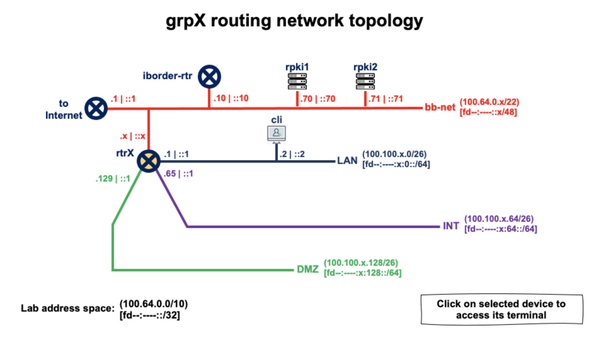

# Laboratorio de RPKI (Utilizando um validador FORT e FRR como software router)

------

***Criado por:***

***Santiago Aggio***,
***Nicolas Antoniello*** (*GitHub: 65007*),
***Guillermo Cicileo,***
***Erika Vega,***
***Silvia Chavez***

> Atualizado: (2025-05-20)

------


## Arquitetura de rede do laboratório




> Este laboratório assume que você tem acesso à plataforma do laboratório

```
  EQUIPAMENTO          ENDEREÇO IPv4            ENDEREÇO IPv6

+--------------+-----------------------+-----------------------------+
| grpX-cli     | 100.100.X.2 (eth0)    | fd47:d767:X::2 (eth0)        |
+--------------+-----------------------+-----------------------------+
| grpX-rtr     | 100.64.1.X (eth0)     | fd47:d767:X::1 (eth1)        |
|              | 100.100.X.65 (eth2)   | fd47:d767:X:64::1 (eth2)     |
|              | 100.100.X.193 (eth4)  | fd47:d767:X:192::1 (eth4)    |
|              | 100.100.X.129 (eth3)  | fd47:d767:X:128::1 (eth3)    |
|              | 100.100.X.1 (eth1)    | fd47:d767:0:1::X (eth0)      |
+--------------+-----------------------+-----------------------------+
| iborder-rtr  | 198.18.0.2 (wg0)      | fd47:d767::10 (eth0)         |
+--------------+-----------------------+-----------------------------+
| rpki1        | 100.64.0.70 (eth0)    | fd47:d767::70 (eth0)         |
+--------------------------------------+-----------------------------+
| rpki2        | 100.64.0.71 (eth0)    | fd47:d767::71 (eth0)         |
+--------------+-----------------------+-----------------------------+
```

Nesta prática, vamos acessar **somente** os seguintes equipamentos:

* **grpX-cli** : cliente
* **grpX-rtr** : roteador (de borda) correspondente às redes do equipamento X


Os seguintes equipamentos também serão utilizados durante a prática, porém os grupos não terão acesso a eles, sendo configurados pelos tutores responsáveis pelo laboratório: 

* **rpki1** : validador RPKI (FORT)
* **rpki2** : validador RPKI (FORT)
* **iborder-rtr** : roteador de borda de todo o laboratório


## Verificando a configuração do validador RPKI FORT (*rpki1* e *rpki2*)

Um dos tutores do laboratório mostrará a configuração do validador FORT (conteúdo do arquivo 
`/etc/fort/config.json` no servidor **rpki1** ou **rpki2**):

```
root@rpki1:~# more /etc/fort/config.json 

{
	"tal": "/var/fort/tal",
	"local-repository": "/var/fort/repository",
	"rsync-strategy": "root",
	"shuffle-uris": true,
	"mode": "server",

	"server": {
		"port": "323",
		"backlog": 100,
		"interval": {
	            "validation": 900,
	            "refresh": 900,
	            "retry": 600,
	            "expire": 7200
	        }
	},

	"log": {
		"color-output": true,
		"file-name-format": "file-name"
	},

	"rsync": {
		"program": "rsync",
		"arguments-recursive": [
			"--recursive",
			"--times",
			"$REMOTE",
			"$LOCAL"
		],
		"arguments-flat": [
			"--times",
			"--dirs",
			"$REMOTE",
			"$LOCAL"
		]
	},

	"incidences": [
		{
			"name": "incid-hashalg-has-params",
			"action": "ignore"
		}
	],

	"output": {
		"roa": "/var/fort/fort_roas.csv"
	}
}

```


Os arquivos correspondentes aos TAL de cada um dos 5 RIRs estão localizados no diretório `/var/fort/tal/`:

```
root@rpki1:~# ls -larth /var/fort/tal/

total 6.0K
drwxr-xr-x 4 root root   5 Sep 24 00:36 ..
-rw-r--r-- 1 root root 496 Sep 20 15:10 afrinic.tal
-rw-r--r-- 1 root root 466 Sep 20 15:10 apnic.tal
-rw-r--r-- 1 root root 487 Sep 20 15:10 arin.tal
-rw-r--r-- 1 root root 502 Sep 20 15:10 lacnic.tal
-rw-r--r-- 1 root root 482 Sep 20 15:10 ripe-ncc.tal
drwxr-xr-x 2 root root   7 Sep 20 15:10 .
```


Agora atualizaremos os arquivos com os TALs, baixando-os novamente dos 5 RIRs, utilizando o seguinte comando:


```
root@rpki1:~# fort --init-tals --tal /var/fort/tal
```

```
Sep 27 18:11:44 DBG: HTTP GET: https://rpki.afrinic.net/tal/afrinic.tal
Successfully fetched '/var/fort/tal/afrinic.tal'!

Sep 27 18:11:45 DBG: HTTP GET: https://tal.apnic.net/apnic.tal
Successfully fetched '/var/fort/tal/apnic.tal'!

Attention: ARIN requires you to agree to their Relying Party Agreement (RPA) before you can download and use their TAL.
Please download and read https://www.arin.net/resources/manage/rpki/rpa.pdf
If you agree to the terms, type 'yes' and hit Enter: Sep 27 18:11:47 DBG: HTTP GET: https://www.arin.net/resources/manage/rpki/arin.tal
Successfully fetched '/var/fort/tal/arin.tal'!

Sep 27 18:11:47 DBG: HTTP GET: https://www.lacnic.net/innovaportal/file/4983/1/lacnic.tal
Successfully fetched '/var/fort/tal/lacnic.tal'!

Sep 27 18:11:48 DBG: HTTP GET: https://tal.rpki.ripe.net/ripe-ncc.tal
Successfully fetched '/var/fort/tal/ripe-ncc.tal'!
```


Confirmamos (observando a data) que de fato temos a versão atual dos TALs (no diretório `/var/fort/tal/`):


```
root@rpki1:~# ls -larth /var/fort/tal/

total 6.0K
drwxr-xr-x 4 root root   5 Sep 24 00:36 ..
-rw-r--r-- 1 root root 496 Sep 27 18:11 afrinic.tal
-rw-r--r-- 1 root root 466 Sep 27 18:11 apnic.tal
-rw-r--r-- 1 root root 487 Sep 27 18:11 arin.tal
-rw-r--r-- 1 root root 502 Sep 27 18:11 lacnic.tal
-rw-r--r-- 1 root root 482 Sep 27 18:11 ripe-ncc.tal
drwxr-xr-x 2 root root   7 Sep 27 18:11 .
```


E reiniciamos o processo do validador FORT (lembrando que o validador foi instalado e executado como daemon do sistema):

```
root@rpki1:~# systemctl restart fortd
```

```
root@rpki1:~# systemctl status fortd

● fortd.service - FORT service (fort) - FORT RPKI validator
     Loaded: loaded (/lib/systemd/system/fortd.service; enabled; vendor preset: enabled)
    Drop-In: /run/systemd/system/service.d
             └─zzz-lxc-service.conf
     Active: active (running) since Mon 2021-09-27 18:15:10 UTC; 7s ago
   Main PID: 1956 (fort)
      Tasks: 37 (limit: 19204)
     Memory: 13.2M
     CGroup: /system.slice/fortd.service
             └─1956 /usr/local/bin/fort --configuration-file=/etc/fort/config.json

Sep 27 18:15:10 rpki1.lac.te-labs.training systemd[1]: Started FORT service (fort) - FORT RPKI validator.
Sep 27 18:15:10 rpki1.lac.te-labs.training fort[1956]: INF: Disabling validation logging on syslog.
Sep 27 18:15:10 rpki1.lac.te-labs.training fort[1956]: INF: Disabling validation logging on standard streams.
Sep 27 18:15:10 rpki1.lac.te-labs.training fort[1956]: INF: Console log output configured; disabling operation logging on syslog.
Sep 27 18:15:10 rpki1.lac.te-labs.training fort[1956]: INF: (Operation Logs will be sent to the standard streams only.)
```


Visualizando o log do daemon **fortd** (`/var/log/fortd.log`), vemos que iniciou o primeiro ciclo de validação (após o reinício), portanto devemos aguardar a finalização deste primeiro ciclo para poder utilizar o validador:

```
root@rpki1:~# tail -f /var/log/fortd.log

/usr/local/bin/fort(+0x3577a)[0x55c4aa92077a]
/usr/local/bin/fort(+0x362a1)[0x55c4aa9212a1]
/usr/local/bin/fort(+0x45fbc)[0x55c4aa930fbc]
/lib/x86_64-linux-gnu/libpthread.so.0(+0x9609)[0x7fc904e47609]
/lib/x86_64-linux-gnu/libc.so.6(clone+0x43)[0x7fc904d6e293]
Sep 27 18:15:10 INF: Disabling validation logging on syslog.
Sep 27 18:15:10 INF: Disabling validation logging on standard streams.
Sep 27 18:15:10 INF: Console log output configured; disabling operation logging on syslog.
Sep 27 18:15:10 INF: (Operation Logs will be sent to the standard streams only.)
Sep 27 18:15:10 WRN: First validation cycle has begun, wait until the next notification to connect your router(s)
```


Uma vez que o ciclo finalize, a seguinte mensagem aparecerá no log (`/var/log/fortd.log`):

```
Sep 27 18:18:13 WRN: First validation cycle successfully ended, now you can connect your router(s)
```

> Observe que o validador leva alguns minutos para completar o primeiro ciclo de validação


### Visualizando os ROAs por meio de um cliente RTR

Para simular o comportamento do nosso roteador e verificar o protocolo RTR (RPKI To Router) com o validador, executamos o comando `rtrclient` apontando para o endereço IP do validador (***100.64.0.70*** ou ***100.64.0.71***) e para a porta ***TCP 323*** onde o validador responde. O restante dos parâmetros serve para indicar o formato de saída (.csv) e o arquivo onde armazenar as informações.  

```
rtrclient -e -t csv -o roas.csv tcp 100.64.0.70 323
```

 Podemos verificar se nossos blocos IPv4, IPv6 e o respectivo ASN estão presentes na lista de ROAs válidos

```
grep "bloque_IPv4" roas.csv
```

 ou

```
grep "bloque_IPv6" roas.csv
```

 ou

```
grep ", ASN$" roas.csv
```


## Verificando a configuração do roteador de borda ***iborder-rtr***

Um dos tutores do laboratório mostrará a configuração do roteador de borda (conteúdo do arquivo `/etc/frr/frr.conf` no equipamento **iborder-rtr**):


```
root@iborder-rtr:~# more /etc/frr/frr.conf

frr version 8.0.1
frr defaults traditional
hostname iborder-rtr
service integrated-vtysh-config
!
ip route 0.0.0.0/0 100.64.0.1
ip route 198.18.0.2/32 172.30.0.1
ipv6 route ::/0 fd47:d767::1
!
interface eth0
 description "class backbone"
 ip address 100.64.0.10/22
 ipv6 address fd47:d767::10/48
!
interface wg0
 description "ISP LACNOG"
 ip address 172.30.0.2/29
!
router bgp 65000
 bgp router-id 100.64.0.10
 bgp log-neighbor-changes
 no bgp default ipv4-unicast
 neighbor 100.64.1.1 remote-as 65001
 neighbor 100.64.1.1 description grp1-rtr
 neighbor 100.64.1.2 remote-as 65002
 neighbor 100.64.1.2 description grp2-rtr
 neighbor 100.64.1.3 remote-as 65003
 neighbor 100.64.1.3 description grp3-rtr
 ...
 neighbor 172.30.0.1 remote-as 64135
 neighbor 172.30.0.1 description iborder-rtr-LACNOG
 neighbor fd47:d767:0:1::1 remote-as 65001
 neighbor fd47:d767:0:1::1 description grp1-rtr
 neighbor fd47:d767:0:1::2 remote-as 65002
 neighbor fd47:d767:0:1::2 description grp2-rtr
 neighbor fd47:d767:0:1::3 remote-as 65003
 neighbor fd47:d767:0:1::3 description grp3-rtr
 ...
 !
 address-family ipv4 unicast
  neighbor 100.64.1.1 activate
  neighbor 100.64.1.1 soft-reconfiguration inbound
  neighbor 100.64.1.1 route-map TODO-IPv4 in
  neighbor 100.64.1.1 route-map TODO-IPv4 out
  neighbor 100.64.1.2 activate
  neighbor 100.64.1.2 soft-reconfiguration inbound
  neighbor 100.64.1.2 route-map TODO-IPv4 in
  neighbor 100.64.1.2 route-map TODO-IPv4 out
  neighbor 100.64.1.3 activate
  neighbor 100.64.1.3 soft-reconfiguration inbound
  neighbor 100.64.1.3 route-map TODO-IPv4 in
  neighbor 100.64.1.3 route-map TODO-IPv4 out
  ...
  neighbor 172.30.0.1 activate
  neighbor 172.30.0.1 soft-reconfiguration inbound
  neighbor 172.30.0.1 route-map PERMIT-SOME-ASN in
  neighbor 172.30.0.1 route-map NADA-IPv4 out
 exit-address-family
 !
 address-family ipv6 unicast
  neighbor 172.30.0.1 activate
  neighbor 172.30.0.1 soft-reconfiguration inbound
  neighbor 172.30.0.1 route-map PERMIT-SOME-ASN in
  neighbor 172.30.0.1 route-map NADA-IPv4 out
  neighbor fd47:d767:0:1::1 activate
  neighbor fd47:d767:0:1::1 soft-reconfiguration inbound
  neighbor fd47:d767:0:1::1 route-map TODO-IPv6 in
  neighbor fd47:d767:0:1::1 route-map TODO-IPv6 out
  neighbor fd47:d767:0:1::2 activate
  neighbor fd47:d767:0:1::2 soft-reconfiguration inbound
  neighbor fd47:d767:0:1::2 route-map TODO-IPv6 in
  neighbor fd47:d767:0:1::2 route-map TODO-IPv6 out
  neighbor fd47:d767:0:1::3 activate
  neighbor fd47:d767:0:1::3 soft-reconfiguration inbound
  neighbor fd47:d767:0:1::3 route-map TODO-IPv6 in
  neighbor fd47:d767:0:1::3 route-map TODO-IPv6 out
  ...
 exit-address-family
!
ip prefix-list DENY-ALL-IPv4 seq 5 deny any
ip prefix-list PERMIT-ALL-IPv4 seq 5 permit any
!
ipv6 prefix-list DENY-ALL-IPv6 seq 5 deny any
ipv6 prefix-list PERMIT-ALL-IPv6 seq 5 permit any
!
bgp as-path access-list AS-PATH-PERMIT-LIST seq 10 permit _28000_
bgp as-path access-list AS-PATH-PERMIT-LIST seq 20 permit _28001_
bgp as-path access-list AS-PATH-PERMIT-LIST seq 30 permit _12654_
bgp as-path access-list AS-PATH-PERMIT-LIST seq 40 permit _196615_
bgp as-path access-list AS-PATH-PERMIT-LIST seq 50 permit _64135_
bgp as-path access-list AS-PATH-PERMIT-LIST seq 60 permit _64136_
!
route-map NADA-IPv4 permit 10
 match ip address prefix-list DENY-ALL-IPv4
!
route-map PERMIT-SOME-ASN permit 10
 match as-path AS-PATH-PERMIT-LIST
!
route-map NADA-IPv6 permit 10
 match ipv6 address prefix-list DENY-ALL-IPv6
!
route-map TODO-IPv4 permit 10
 match ip address prefix-list PERMIT-ALL-IPv4
!
route-map TODO-IPv6 permit 10
 match ipv6 address prefix-list PERMIT-ALL-IPv6
!
route-map RPKI permit 10
 match rpki valid
 set local-preference 200
!
route-map RPKI permit 20
 match rpki notfound
 set local-preference 100
!
line vty
!
end
```


Vemos que esse roteador de borda tem uma sessão BGP estabelecida com um ISP, do qual recebe a tabela global IPv4 e IPv6.

Também estão pré-configuradas neste roteador de borda sessões BGP com cada um dos roteadores de borda dos grupos, aguardando que estes configurem as sessões BGP do seu lado.

Para evitar sobrecarregar todos os roteadores dos grupos e o laboratório em geral, foi aplicado um filtro que permitirá ao BGP incluir apenas alguns prefixos (correspondentes a determinados ASNs) nas tabelas BGP (tanto IPv4 quanto IPv6).


> ***Por fim, observe que esse roteador não possui nenhum filtro de rotas baseado em informações RPKI; ele encaminha aos roteadores de borda dos grupos todos os prefixos permitidos no filtro BGP por ASN mencionado anteriormente*** ***(ao mesmo tempo em que aceita tudo o que os equipamentos enviarem)***.

## Verificando a configuração inicial dos roteadores de borda dos grupos

Verificamos a configuração inicial do roteador de borda correspondente ao nosso grupo (**grpX-rtr**):


```
grpX-rtr# sh run
Building configuration...

Current configuration:
!
frr version 8.0.1
frr defaults traditional
hostname grpX-rtr
service integrated-vtysh-config
!
ip route 0.0.0.0/0 100.64.0.1
ipv6 route ::/0 fd47:d767::1
!
interface eth0
 description "class backbone"
 ip address 100.64.1.X/22
 ipv6 address fd47:d767:0:1::X/48
!
interface eth1
 description "lan"
 ip address 100.100.X.1/26
 ipv6 address fd47:d767:X::1/64
!
interface eth2
 description "int"
 ip address 100.100.X.65/26
 ipv6 address fd47:d767:X:64::1/64
!
interface eth3
 description "dmz"
 ip address 100.100.X.129/26
 ipv6 address fd47:d767:X:128::1/64
!
interface eth4
 description "extra"
 ip address 100.100.X.193/26
 ipv6 address fd47:d767:X:192::1/64
!
line vty
!
end
```


> Neste ponto, é conveniente revisar novamente o diagrama de rede correspondente a cada grupo e identificar as interfaces já configuradas no roteador do grupo.

Agora, modificamos a configuração do roteador correspondente ao nosso grupo, para que fique da seguinte forma (*os detalhes dos passos de configuração estão mais abaixo*):


```
grpX-rtr# sh run
Building configuration...

Current configuration:
!
frr version 8.0.1
frr defaults traditional
hostname grpX-rtr
rpki
 rpki polling_period 300
 rpki cache 100.64.0.70 323 preference 1
 rpki cache 100.64.0.71 323 preference 2
 exit
service integrated-vtysh-config
!
ip route 0.0.0.0/0 100.64.0.1
ipv6 route ::/0 fd47:d767::1
!
interface eth0
 description "class backbone"
 ip address 100.64.1.X/22
 ipv6 address fd47:d767:0:1::X/48
!
interface eth1
 description "lan"
 ip address 100.100.X.1/26
 ipv6 address fd47:d767:X::1/64
!
interface eth2
 description "int"
 ip address 100.100.X.65/26
 ipv6 address fd47:d767:X:64::1/64
!
interface eth3
 description "dmz"
 ip address 100.100.X.129/26
 ipv6 address fd47:d767:X:128::1/64
!
interface eth4
 description "extra"
 ip address 100.100.X.193/26
 ipv6 address fd47:d767:X:192::1/64
!
router bgp 6500X
 bgp router-id 100.64.1.X
 bgp log-neighbor-changes
 no bgp default ipv4-unicast
 neighbor 100.64.0.10 remote-as 65000
 neighbor 100.64.0.10 description iborder-rtr
 neighbor fd47:d767::10 remote-as 65000
 neighbor fd47:d767::10 description iborder-rtr
 !
 address-family ipv4 unicast
  neighbor 100.64.0.10 activate
  neighbor 100.64.0.10 soft-reconfiguration inbound
  neighbor 100.64.0.10 route-map TODO-IPv4 in
  neighbor 100.64.0.10 route-map TODO-IPv4 out
 exit-address-family
 !
 address-family ipv6 unicast
  neighbor fd47:d767::10 activate
  neighbor fd47:d767::10 soft-reconfiguration inbound
  neighbor fd47:d767::10 route-map TODO-IPv6 in
  neighbor fd47:d767::10 route-map TODO-IPv6 out
 exit-address-family
!
ip prefix-list DENY-ALL-IPv4 seq 5 deny any
ip prefix-list PERMIT-ALL-IPv4 seq 5 permit any
!
ipv6 prefix-list DENY-ALL-IPv6 seq 5 deny any
ipv6 prefix-list PERMIT-ALL-IPv6 seq 5 permit any
!
route-map PERMIT-SOME-ASN permit 10
 match as-path AS-PATH-PERMIT-LIST
!
route-map TODO-IPv6 permit 10
 match ipv6 address prefix-list PERMIT-ALL-IPv6
!
route-map NADA-IPv6 permit 10
 match ipv6 address prefix-list DENY-ALL-IPv6
!
route-map TODO-IPv4 permit 10
 match ip address prefix-list PERMIT-ALL-IPv4
!
route-map NADA-IPv4 permit 10
 match ipv6 address prefix-list DENY-ALL-IPv4
!
route-map RPKI permit 10
 match rpki valid
 set local-preference 200
!
route-map RPKI permit 20
 match rpki notfound
 set local-preference 100
!
line vty
!
end
```


#### Adicionamos então alguns route-maps e listas de acesso que utilizaremos mais adiante

> Os seguintes serão explicados à medida que os utilizarmos durante a prática
>

```
ip prefix-list DENY-ALL-IPv4 seq 5 deny any
ip prefix-list PERMIT-ALL-IPv4 seq 5 permit any
!
ipv6 prefix-list DENY-ALL-IPv6 seq 5 deny any
ipv6 prefix-list PERMIT-ALL-IPv6 seq 5 permit any
!
route-map PERMIT-SOME-ASN permit 10
 match as-path AS-PATH-PERMIT-LIST
!
route-map TODO-IPv6 permit 10
 match ipv6 address prefix-list PERMIT-ALL-IPv6
!
route-map NADA-IPv6 permit 10
 match ipv6 address prefix-list DENY-ALL-IPv6
!
route-map TODO-IPv4 permit 10
 match ip address prefix-list PERMIT-ALL-IPv4
!
route-map NADA-IPv4 permit 10
 match ipv6 address prefix-list DENY-ALL-IPv4
!
route-map RPKI permit 10
 match rpki valid
 set local-preference 200
!
route-map RPKI permit 20
 match rpki notfound
 set local-preference 100
```


#### Configuramos a sessão BGP com o roteador de borda (**iborder-rtr**)

> Observe que nosso sistema autônomo será o 650XX, substituindo o XX pelo número do nosso grupo (01 para o grupo 1, ... 12 para o grupo 12, etc). Assim, o grupo 1 terá o ASN 65001 e o grupo 12 terá o ASN 65012.
>

Configuramos 2 sessões BGP, uma para IPv4 e outra para IPv6.

Neste ponto, aplicaremos políticas (***route-map***) em ambas as sessões de forma a ***permitir todos*** os prefixos recebidos do roteador de borda e anunciar a ele todos os prefixos que tivermos em nossa tabela BGP (para isso utilizamos alguns dos route-maps criados anteriormente): ***route-map TODO-IPv4*** e ***route-map TODO-IPv6***.

```
router bgp 650XX
 bgp router-id 100.64.1.X
 bgp log-neighbor-changes
 no bgp default ipv4-unicast
 neighbor 100.64.0.10 remote-as 65000
 neighbor 100.64.0.10 description iborder-rtr
 neighbor fd47:d767::10 remote-as 65000
 neighbor fd47:d767::10 description iborder-rtr
 !
 address-family ipv4 unicast
  neighbor 100.64.0.10 activate
  neighbor 100.64.0.10 soft-reconfiguration inbound
  neighbor 100.64.0.10 route-map TODO-IPv4 in
  neighbor 100.64.0.10 route-map TODO-IPv4 out
 exit-address-family
 !
 address-family ipv6 unicast
  neighbor fd47:d767::10 activate
  neighbor fd47:d767::10 soft-reconfiguration inbound
  neighbor fd47:d767::10 route-map TODO-IPv6 in
  neighbor fd47:d767::10 route-map TODO-IPv6 out
 exit-address-family
```


#### Visualizamos o estado das sessões BGP (IPv6)

```
grpX-rtr# sh bgp ipv6 unicast summary 
BGP router identifier 100.64.1.X, local AS number 650XX vrf-id 0
BGP table version 557
RIB entries 88, using 16 KiB of memory
Peers 1, using 723 KiB of memory

Neighbor        V         AS   MsgRcvd   MsgSent   TblVer  InQ OutQ  Up/Down State/PfxRcd   PfxSnt Desc
fd47:d767::10   4      65000     15619     10555        0    0    0 01w0d01h           46       46 iborder-rtr

Total number of neighbors 1
```


#### Visualizamos o estado da tabela BGP (IPv6)

```
grpX-rtr# sh bgp ipv6 unicast
BGP table version is 15706, local router ID is 100.64.1.X, vrf id 0
Default local pref 100, local AS 65001
Status codes:  s suppressed, d damped, h history, * valid, > best, = multipath,
               i internal, r RIB-failure, S Stale, R Removed
Nexthop codes: @NNN nexthop's vrf id, < announce-nh-self
Origin codes:  i - IGP, e - EGP, ? - incomplete
RPKI validation codes: V valid, I invalid, N Not found

   Network          Next Hop            Metric LocPrf Weight Path
*> 2001:7fb:fd02::/48
                    fe80::216:3eff:fee0:2b4b
                                                           0 65000 64512 264759 7049 3549 3356 8455 12654 i
*> 2001:7fb:fe00::/48
                    fe80::216:3eff:fee0:2b4b
                                                           0 65000 64512 264759 7049 3549 3356 30781 204092 12654 i
*> 2001:7fb:fe01::/48
                    fe80::216:3eff:fee0:2b4b
                                                           0 65000 64512 264759 7049 3549 3356 9002 12654 i
*> 2001:7fb:fe03::/48
                    fe80::216:3eff:fee0:2b4b
                                                           0 65000 64512 264759 7049 3549 3356 8455 12654 i
```


#### Adicionamos a configuração para conectar o roteador ao nosso validador RPKI

Para conectar o roteador ao validador RPKI, podemos utilizar o endereço IPv4 do validador ou seu nome de domínio... neste caso, utilizaremos os endereços IPv4:

**rpki1**:  *100.64.0.70*

**rpki2**:  *100.64.0.71*

E a porta TCP que configuramos nos servidores — no nosso caso, ambos utilizam a porta 323.

Por fim, também devemos indicar a preferência de cada servidor, de forma que o nosso roteador tentará primeiro aquele com menor valor de preferência.


```
rpki
 rpki polling_period 300
 rpki cache 100.64.0.70 323 preference 1
 rpki cache 100.64.0.71 323 preference 2
```


Neste ponto, já temos completamente configurado o nosso roteador de borda e podemos começar a visualizar alguns detalhes e testar diferentes cenários.

#### Visualização da configuração do validador RPKI


```
grpX-rtr# sh rpki cache-connection 
Connected to group 1
rpki tcp cache 100.64.0.70 323 pref 1
```


#### Visualização do estado de validação de um prefixo em particular

```
grpX-rtr# sh rpki prefix 2803:9910:8000::/48
Prefix                                   Prefix Length  Origin-AS
2803:9910:8000::                            34 -  48        64135
```


#### Visualizamos o estado da tabela BGP (IPv6)

```
grpX-rtr# sh bgp ipv6 unicast
BGP table version is 8453, local router ID is 100.64.1.X, vrf id 0
Default local pref 100, local AS 650XX
Status codes:  s suppressed, d damped, h history, * valid, > best, = multipath,
               i internal, r RIB-failure, S Stale, R Removed
Nexthop codes: @NNN nexthop's vrf id, < announce-nh-self
Origin codes:  i - IGP, e - EGP, ? - incomplete
RPKI validation codes: V valid, I invalid, N Not found

   Network          Next Hop            Metric LocPrf Weight Path
V*> 2001:7fb:fd02::/48
                    fe80::216:3eff:fee0:2b4b
                                                           0 65000 64512 264759 7049 3549 3356 8455 12654 i
V*> 2001:7fb:fe00::/48
                    fe80::216:3eff:fee0:2b4b
                                                           0 65000 64512 264759 7049 3549 3356 30781 204092 12654 i
V*> 2001:7fb:fe01::/48
                    fe80::216:3eff:fee0:2b4b
                                                           0 65000 64512 264759 7049 3549 3356 9002 12654 i
V*> 2001:7fb:fe03::/48
                    fe80::216:3eff:fee0:2b4b
                                                           0 65000 64512 264759 7049 3549 3356 8455 12654 i
V*> 2001:7fb:fe04::/48
                    fe80::216:3eff:fee0:2b4b
                                                           0 65000 64512 264759 7049 3549 3356 25091 513 12654 i
```


## Análise de um prefixo específico como demonstração

Visualizamos o prefixo ***2803:9910:8000::1*** na tabela BGP

```
grpX-rtr# sh bgp ipv6 unicast 2803:9910:8000::1
BGP routing table entry for 2803:9910:8000::/34, version 32
Paths: (1 available, best #1, table default)
  Advertised to non peer-group peers:
  fd47:d767::10
  65000 64135
    fd47:d767::10 from fd47:d767::10 (100.64.0.10)
    (fe80::216:3eff:fecf:e070) (used)
      Origin IGP, valid, external, best (First path received), rpki validation-state: valid
      Last update: Tue Apr 26 23:21:23 2022
```


* ***O que acontece com o estado de validação?***
* ***Qual ASN origina o prefixo?***


Acessamos o cliente e realizamos um mtr (traceroute) para esse prefixo (***2803:9910:8000::1***) e deixamos a execução em andamento


```
root@cli:~# mtr 2803:9910:8000::1

cli.grpX.lac.te-labs.training (fd47:d767:X::2)                 2021-10-04T22:06:48+0000
Keys:  Help   Display mode   Restart statistics   Order of fields   quit
                                               Packets               Pings
 Host                                        Loss%   Snt   Last   Avg  Best  Wrst StDev
 1. fd47:d767:1::1                            0.0%    10    0.1   0.1   0.1   0.1   0.0
 2. fd47:d767::10                             0.0%    10    0.1   0.1   0.1   0.2   0.0
 3. fd47:d767::1                              0.0%    10    0.1   0.1   0.1   0.1   0.0
 4. (waiting for reply)
 5. (waiting for reply)
 6. (waiting for reply)
 7. 2620:107:4000:cfff::f3ff:1e61             0.0%    10    0.8   0.8   0.7   1.0   0.1
 8. 2620:107:4000:c5e0::f3fd:c02              0.0%    10    0.7   0.7   0.6   0.8   0.1
 9. 2620:107:4000:a710::f000:3013             0.0%    10    0.7   0.8   0.7   0.9   0.0
10. 2620:107:4000:a710::f000:3005             0.0%    10    0.9   0.9   0.8   1.0   0.1
11. 2620:107:4000:cfff::f200:baa1             0.0%    10    0.7   1.5   0.5   5.5   1.6
12. 2620:107:4000:2000::b3                    0.0%    10    0.9   4.0   0.6  15.0   5.4
13. 2620:107:4000:8002::26                    0.0%    10    0.7   1.3   0.6   6.4   1.8
14. 2620:107:4008:575::2                      0.0%    10    0.8   0.9   0.8   1.3   0.1
15. ae27.mpr1.cdg11.fr.zip.zayo.com           0.0%     9   84.4  79.2  78.3  84.4   2.0
16. ae10.tcr2.th2.par.core.as8218.eu          0.0%     9   78.2  81.3  78.2 103.9   8.5
17. 2001:1b48:2:3::24:1                       0.0%     9   78.4  78.8  78.4  80.4   0.8
18. ...							                          0.0%     9   90.8  90.8  90.7  90.8   0.0
   
```


Agora aguardamos enquanto os instrutores realizam algumas modificações... observando o que acontece com o MTR.

> Discussão

- ***O que foi observado?***
- Tente atualizar o mtr (*pressionando a tecla "r"*)


```
cli.grpX.lac.te-labs.training (fd47:d767:X::2)                 2021-10-04T22:25:36+0000
Keys:  Help   Display mode   Restart statistics   Order of fields   quit
                                               Packets               Pings
 Host                                        Loss%   Snt   Last   Avg  Best  Wrst StDev
 1. fd47:d767:1::1                            0.0%   131    0.2   0.1   0.1   0.2   0.0
 2. fd47:d767::10                             0.0%   130    0.2   0.1   0.1   0.2   0.1
 3. 2803:9910:8000::1                         0.0%   130    0.2   0.1   0.1   0.4   0.1
```


Visualizamos o prefixo na nossa tabela BGP

```
grpX-rtr# sh bgp ipv6 unicast 2803:9910:8000::1
BGP routing table entry for 2803:9910:8000::/48, version 155
Paths: (1 available, best #1, table default)
  Advertised to non peer-group peers:
  fd47:d767:0:1::1 fd47:d767:0:1::2 fd47:d767:0:1::3 fd47:d767:0:1::4 fd47:d767:0:1::5
  65000 65002
    fd47:d767:0:1::2 from fd47:d767:0:1::2 (100.64.1.2)
    (fe80::216:3eff:fe8b:4d79) (used)
      Origin IGP, metric 0, valid, external, best (First path received), rpki validation-state: invalid
      Last update: Tue Apr 26 23:24:44 2022
```


* ***O que acontece com o estado de validação?***
* ***Qual ASN origina o prefixo?***
* ***O que aconteceu?***
* Então, se o estado é Inválido e eu tenho o RPKI ativado, ***por que continuo vendo o prefixo na minha tabela BGP?***


### Configurando filtros BGP com base no estado de validação

Aplicamos o filtro "RPKI", que instalará na tabela BGP apenas os prefixos com estado "valid" ou "not found" (descartando os "invalid")


```
grpX-rtr# conf t
grpX-rtr(config)# router bgp 650XX
grpX-rtr(config-router)# address-family ipv6 unicast
grpX-rtr(config-router-af)# neighbor fd47:d767::10 route-map RPKI in
```


Visualizamos o prefixo na nossa tabela BGP

```
grpX-rtr# sh bgp ipv6 unicast 2803:9910:8000::1
BGP routing table entry for 2803:9910:8000::/34, version 125
Paths: (1 available, best #1, table default)
  Advertised to non peer-group peers:
  fd47:d767::10
  65000 64135
    fd47:d767::10 from fd47:d767::10 (100.64.0.10)
    (fe80::216:3eff:fecf:e070) (used)
      Origin IGP, localpref 200, valid, external, best (First path received), rpki validation-state: valid
      Last update: Wed Apr 27 00:03:42 2022
```


* ***O que acontece com o estado de validação?***
* ***Qual ASN origina o prefixo?***
* ***O que aconteceu?***

No cliente, visualizamos novamente o MTR — tente atualizá-lo (pressionando a tecla "r")

```
cli.grpX.lac.te-labs.training (fd47:d767:X::2)                 2021-10-04T22:50:51+0000
Keys:  Help   Display mode   Restart statistics   Order of fields   quit
                                               Packets               Pings
 Host                                        Loss%   Snt   Last   Avg  Best  Wrst StDev
 1. fd47:d767:1::1                            0.0%     8    0.1   0.1   0.1   0.2   0.0
 2. fd47:d767::10                      				0.0%     8    0.2   0.1   0.1   0.2   0.0
 3. 2803:9910:8000::1													0.0%     7    0.2   0.2   0.1   0.2   0.0

```


* ***O que aconteceu? Como você explica?***

  (Dica: lembrar da topologia da rede e quem fornece a conectividade com a Internet)

### Os tutores irão habilitar filtros RPKI semelhantes no roteador iborder-rtr (ASN 65000)

Os tutores aplicam o filtro RPKI no roteador de borda.


Acessamos o cliente e observamos o que está acontecendo. Tente atualizar (pressionando a tecla "r")

```
cli.grpX.lac.te-labs.training (fd47:d767:X::2)                 2021-10-04T23:09:10+0000
Keys:  Help   Display mode   Restart statistics   Order of fields   quit
                                               Packets               Pings
 Host                                        Loss%   Snt   Last   Avg  Best  Wrst StDev
 1. fd47:d767:1::1                            0.0%    20    0.1   0.1   0.1   0.1   0.0
 2. fd47:d767::10                             0.0%    20    0.1   0.1   0.1   0.1   0.0
 3. fd47:d767::1                              0.0%    20    0.1   0.1   0.1   0.2   0.0
 4. (waiting for reply)
 5. (waiting for reply)
 6. (waiting for reply)
 7. 2620:107:4000:cfff::f3ff:c41              0.0%    20    0.6   0.7   0.6   0.9   0.1
 8. 2620:107:4000:cfff::f200:9850             0.0%    20    0.9   0.8   0.7   0.9   0.1
 9. 2620:107:4000:a5d0::f000:2010             0.0%    20    0.7   0.8   0.7   0.9   0.1
10. 2620:107:4000:a5d0::f000:2006             0.0%    20    0.8  57.6   0.8 261.1  87.4
11. 2620:107:4000:cfff::f200:9b31             0.0%    20    0.6   2.1   0.5  19.9   5.0
12. 2620:107:4000:2000::dd                    0.0%    20    1.0   1.4   0.7   5.2   1.0
13. 2620:107:4000:8002::224                   0.0%    20    0.8   2.6   0.7  19.5   4.5
14. 2620:107:4008:b974::2                     0.0%    20    0.9   0.9   0.8   1.1   0.1
15. ae27.mpr1.cdg11.fr.zip.zayo.com           0.0%    20   78.4  80.5  78.3 102.6   5.3
16. ae10.tcr2.th2.par.core.as8218.eu          0.0%    20   78.3  78.4  78.3  78.8   0.1
17. 2001:1b48:2:3::24:1                       0.0%    19   78.4  78.5  78.3  79.2   0.2
18. ...							                          0.0%    19   91.1  90.9  90.9  91.2   0.1

```


***Conclusões?***

> Discutir como o sequestro de rotas foi resolvido neste caso.

