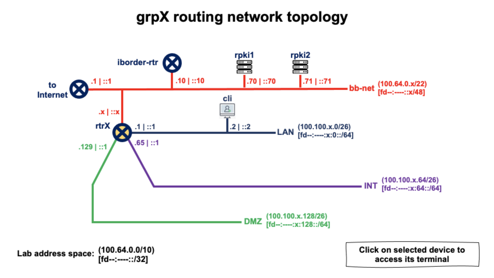

# Laboratorio breve sobre BGP

# (Utilizando FRR como software router)

------

***Creado por:***

***Santiago Aggio***,
***Nicolas Antoniello*** (*GitHub: 65007*),
***Guillermo Cicileo,***
***Erika Vega,***
***Silvia Chavez***

***para LACNOG***

------


## Arquitectura de red del laboratorio




> This Lab assumes you have access to the Lab platform

```
     EQUIPO          DIRECCION IPv4            DIRECCION IPv6

+--------------+-----------------------+-----------------------------+
| grpX-cli     | 100.100.X.2 (eth0)    | fdfb:b42e:X::2 (eth0)        |
+--------------+-----------------------+-----------------------------+
| grpX-rtr     | 100.64.1.X (eth0)     | fdfb:b42e:X::1 (eth1)        |
|              | 100.100.X.65 (eth2)   | fdfb:b42e:X:64::1 (eth2)     |
|              | 100.100.X.193 (eth4)  | fdfb:b42e:X:192::1 (eth4)    |
|              | 100.100.X.129 (eth3)  | fdfb:b42e:X:128::1 (eth3)    |
|              | 100.100.X.1 (eth1)    | fdfb:b42e:0:1::X (eth0)      |
+--------------+-----------------------+-----------------------------+
| iborder-rtr  | 198.18.0.2 (wg0)      | fdfb:b42e::10 (eth0)         |
+--------------+-----------------------+-----------------------------+
| rpki1        | 100.64.0.70 (eth0)    | fdfb:b42e::70 (eth0)         |
+--------------------------------------+-----------------------------+
| rpki2        | 100.64.0.71 (eth0)    | fdfb:b42e::71 (eth0)         |
+--------------+-----------------------+-----------------------------+
```

Donde en esta práctica **solamente** vamos a acceder a los siguientes equipos:

* **grpX-cli** : cliente
* **grpX-rtr** : router (de borde) correspondiente a las redes del equipo X


Los siguientes equipos también serán utilizados durante la práctica, sin embargo los grupos no tendrán acceso a los mismos, siendo estos configurados por los tutores encargados del laboratorio:

* **rpki1** : validador RPKI (FORT)
* **rpki2** : validador RPKI (FORT)
* **iborder-rtr** : router de borde para todo el laboratorio

#### Agregamos algunos route-map y listas de acceso que utilizaremos más tarde

> Los siguientes los iremos explicando a medida que los utilicemos durante la práctica
>

```
ip prefix-list DENY-ALL-IPv4 seq 5 deny any
ip prefix-list PERMIT-ALL-IPv4 seq 5 permit any
!
ipv6 prefix-list DENY-ALL-IPv6 seq 5 deny any
ipv6 prefix-list PERMIT-ALL-IPv6 seq 5 permit any
!
route-map PERMIT-SOME-ASN permit 10
 match as-path AS-PATH-PERMIT-LIST
!
route-map TODO-IPv6 permit 10
 match ipv6 address prefix-list PERMIT-ALL-IPv6
!
route-map NADA-IPv6 permit 10
 match ipv6 address prefix-list DENY-ALL-IPv6
!
route-map TODO-IPv4 permit 10
 match ip address prefix-list PERMIT-ALL-IPv4
!
route-map NADA-IPv4 permit 10
 match ipv6 address prefix-list DENY-ALL-IPv4
!
route-map RPKI permit 10
 match rpki valid
 set local-preference 200
!
route-map RPKI permit 20
 match rpki notfound
 set local-preference 100
```


#### Configuramos la sesión BGP con el router de borde (**iborder-rtr**)

> Observar que nuestro sistema autónomo será el 650XX cambiando la XX por nuestro número de grupo (01 para el grupo 1, ... 12 para el grupo 12, etc). De forma que el grupo 1 tendrá el ASN 65001 y el grupo 12 tendrá el ASN 65012.
>

Configuramos 2 sesiones BGP, una IPv4 y otra IPv6.

En este punto, aplicaremos políticas (***route-map***) en ambas sesiones de forma de ***permitir todos*** los prefijos recibidos del router de borde y publicar al mismo todos los que tengamos en nuestra tabla BGP (para ello utilizamos algunos de los route-map creados anteriormente): ***route-map TODO-IPv4*** y ***route-map TODO-IPv6***.

```
router bgp 650XX
 bgp router-id 100.64.1.X
 bgp log-neighbor-changes
 no bgp default ipv4-unicast
 neighbor 100.64.0.10 remote-as 65000
 neighbor 100.64.0.10 description iborder-rtr
 neighbor fdfb:b42e::10 remote-as 65000
 neighbor fdfb:b42e::10 description iborder-rtr
 !
 address-family ipv4 unicast
  neighbor 100.64.0.10 activate
  neighbor 100.64.0.10 soft-reconfiguration inbound
  neighbor 100.64.0.10 route-map TODO-IPv4 in
  neighbor 100.64.0.10 route-map TODO-IPv4 out
 exit-address-family
 !
 address-family ipv6 unicast
  neighbor fdfb:b42e::10 activate
  neighbor fdfb:b42e::10 soft-reconfiguration inbound
  neighbor fdfb:b42e::10 route-map TODO-IPv6 in
  neighbor fdfb:b42e::10 route-map TODO-IPv6 out
 exit-address-family
```


#### Visualizamos el estado de las sesiones BGP (IPv6)

```
grpX-rtr# sh bgp ipv6 unicast summary 
BGP router identifier 100.64.1.X, local AS number 650XX vrf-id 0
BGP table version 557
RIB entries 88, using 16 KiB of memory
Peers 1, using 723 KiB of memory

Neighbor        V         AS   MsgRcvd   MsgSent   TblVer  InQ OutQ  Up/Down State/PfxRcd   PfxSnt Desc
fdfb:b42e::10   4      65000     15619     10555        0    0    0 01w0d01h           46       46 iborder-rtr

Total number of neighbors 1
```


#### Visualizamos el estado de la tabla BGP (IPv6)

```
grpX-rtr# sh bgp ipv6 unicast
BGP table version is 15706, local router ID is 100.64.1.X, vrf id 0
Default local pref 100, local AS 65001
Status codes:  s suppressed, d damped, h history, * valid, > best, = multipath,
               i internal, r RIB-failure, S Stale, R Removed
Nexthop codes: @NNN nexthop's vrf id, < announce-nh-self
Origin codes:  i - IGP, e - EGP, ? - incomplete
RPKI validation codes: V valid, I invalid, N Not found

   Network          Next Hop            Metric LocPrf Weight Path
*> 2001:7fb:fd02::/48
                    fe80::216:3eff:fee0:2b4b
                                                           0 65000 64512 264759 7049 3549 3356 8455 12654 i
*> 2001:7fb:fe00::/48
                    fe80::216:3eff:fee0:2b4b
                                                           0 65000 64512 264759 7049 3549 3356 30781 204092 12654 i
*> 2001:7fb:fe01::/48
                    fe80::216:3eff:fee0:2b4b
                                                           0 65000 64512 264759 7049 3549 3356 9002 12654 i
*> 2001:7fb:fe03::/48
                    fe80::216:3eff:fee0:2b4b
                                                           0 65000 64512 264759 7049 3549 3356 8455 12654 i
```


#### Agregamos la configuración para conectar el router con nuestro validador RPKI

Para conectar el router al validador RPKI podemos utilizar la dirección IPv4 del validador o el nombre de dominio del mismo... en este caso utilizaremos las direcciones IPv4:

**rpki1**:  *100.64.0.70*

**rpki2**:  *100.64.0.71*


Y el puerto TCP que configuramos en los servidores, en nuestro caso ambos en el puerto 323.

Finalmente también debemos indicar la preferencia de cada servidor de forma que nuestro router intentará primero con el que tenga menor preferencia.

```
rpki
 rpki polling_period 300
 rpki cache 100.64.0.70 323 preference 1
 rpki cache 100.64.0.71 323 preference 2
```


En este punto, ya tenemos completamente configurado nuestro router de borde y podemos comenzar a visualizar algunos detalles y ensayar diferentes escenarios.


#### Visualización de la configuración del validador RPKI

```
grpX-rtr# sh rpki cache-connection 
Connected to group 1
rpki tcp cache 100.64.0.70 323 pref 1
```


#### Visualización del estado de validación de un prefijo en particular

```
grpX-rtr# sh rpki prefix 2803:9910:8000::/48
Prefix                                   Prefix Length  Origin-AS
2803:9910:8000::                            34 -  48        64135
```


#### Visualizamos el estado de la tabla BGP (IPv6)

```
grpX-rtr# sh bgp ipv6 unicast
BGP table version is 8453, local router ID is 100.64.1.X, vrf id 0
Default local pref 100, local AS 650XX
Status codes:  s suppressed, d damped, h history, * valid, > best, = multipath,
               i internal, r RIB-failure, S Stale, R Removed
Nexthop codes: @NNN nexthop's vrf id, < announce-nh-self
Origin codes:  i - IGP, e - EGP, ? - incomplete
RPKI validation codes: V valid, I invalid, N Not found

   Network          Next Hop            Metric LocPrf Weight Path
V*> 2001:7fb:fd02::/48
                    fe80::216:3eff:fee0:2b4b
                                                           0 65000 64512 264759 7049 3549 3356 8455 12654 i
V*> 2001:7fb:fe00::/48
                    fe80::216:3eff:fee0:2b4b
                                                           0 65000 64512 264759 7049 3549 3356 30781 204092 12654 i
V*> 2001:7fb:fe01::/48
                    fe80::216:3eff:fee0:2b4b
                                                           0 65000 64512 264759 7049 3549 3356 9002 12654 i
V*> 2001:7fb:fe03::/48
                    fe80::216:3eff:fee0:2b4b
                                                           0 65000 64512 264759 7049 3549 3356 8455 12654 i
V*> 2001:7fb:fe04::/48
                    fe80::216:3eff:fee0:2b4b
                                                           0 65000 64512 264759 7049 3549 3356 25091 513 12654 i
```


